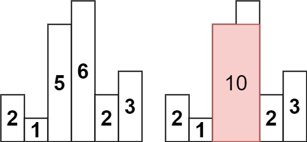

# 柱状图中最大的矩形（Largest Rectangle in Histogram）题解

> 题目链接：[LeetCode 84. Largest Rectangle in Histogram](https://leetcode.cn/problems/largest-rectangle-in-histogram/)

## 题目描述

给定 `n` 个非负整数，用来表示柱状图中各个柱子的高度。每个柱子彼此相邻，且宽度为 1。

求在该柱状图中，能够勾勒出来的矩形的最大面积。



**示例：**

```
输入：heights = [2,1,5,6,2,3]
输出：10
解释：最大的矩形为图中红色区域，由高度为 5 和 6 的两个柱子组成，矩形高度为 5，宽度为 2，面积为 10。
```

---

## 核心思路

我们将问题拆分到每个柱子：对于每个柱子 `i`，以 `heights[i]` 为高度的最大矩形，其宽度由**左右两边第一个低于 `heights[i]` 的柱子**决定。设左边界为 `left[i]`（第一个低于 `heights[i]` 的下标），右边界为 `right[i]`，则该矩形面积为：

```
heights[i] × (right[i] - left[i] - 1)
```

找"左右第一个更小元素"正是单调递增栈的用武之地。下面从两遍扫描到一遍扫描，再到即时计算，层层优化。

---

## 版本一：两遍扫描

第一遍从左到右找 `left[]`，第二遍从右到左找 `right[]`，最后遍历计算答案。

```cpp
class Solution {
public:
    int largestRectangleArea(vector<int>& heights) {
        int n = heights.size();
        vector<int> left(n, -1);   // 左边第一个低于 heights[i] 的下标
        vector<int> right(n, n);   // 右边第一个低于 heights[i] 的下标
        stack<int> st;

        // 第一遍：从左到右，找每个柱子的左边界
        for (int i = 0; i < n; ++i) {
            while (!st.empty() && heights[st.top()] >= heights[i]) {
                st.pop();
            }
            left[i] = st.empty() ? -1 : st.top();
            st.push(i);
        }

        // 清空栈
        while (!st.empty()) st.pop();

        // 第二遍：从右到左，找每个柱子的右边界
        for (int i = n - 1; i >= 0; --i) {
            while (!st.empty() && heights[st.top()] >= heights[i]) {
                st.pop();
            }
            right[i] = st.empty() ? n : st.top();
            st.push(i);
        }

        int ans = 0;
        for (int i = 0; i < n; ++i) {
            ans = max(ans, heights[i] * (right[i] - left[i] - 1));
        }
        return ans;
    }
};
```

### 代码分析

**左边界**：遍历到 `i` 时，弹出栈中所有 `≥ heights[i]` 的元素，这些元素不会是 `i` 右边任何柱子的左边界（因为 `i` 比它们更矮，会挡住它们）。弹出后栈顶就是 `i` 左边第一个比它矮的柱子。

**右边界**：同理，从右往左遍历，栈顶是右边第一个比它矮的柱子。

**注意边界**：`left[i]` 初始化为 `-1`（表示左边没有更矮的，可以延伸到最左端），`right[i]` 初始化为 `n`（延伸到最右端）。这样 `right[i] - left[i] - 1` 恰好是宽度。

---

## 版本二：一遍扫描

版本一需要两遍遍历 + 两个数组。我们发现遍历是从左到右的，那么能不能省去 `right` 数组计算时多余的一轮遍历呢？

有的兄弟，有的。当 `heights[i]` 比栈顶矮时，栈顶的右边界恰好就是 `i`——因为 `i` 是栈顶右边第一个比它矮的柱子。于是我们可以在弹栈时顺便填写 `right[]`。

```cpp
class Solution {
public:
    int largestRectangleArea(vector<int> &heights) {
        int n = heights.size();
        vector<int> left(n, -1);
        vector<int> right(n, n);
        stack<int> st;

        for (int i = 0; i < n; i++) {
            int h = heights[i];
            // 当前柱子比栈顶矮 → 栈顶的右边界就是 i
            while (!st.empty() && heights[st.top()] >= h) {
                right[st.top()] = i;
                st.pop();
            }
            // 此时栈顶是 i 左边第一个比它矮的柱子
            if (!st.empty()) {
                left[i] = st.top();
            }
            st.push(i);
        }

        int ans = 0;
        for (int i = 0; i < n; i++) {
            ans = max(ans, heights[i] * (right[i] - left[i] - 1));
        }
        return ans;
    }
};
```

### 为什么能省掉右边界的那一轮遍历？

版本一从右往左扫描是为了找"右边第一个更小"。但在版本二从左往右扫描时，当 `heights[i]` 迫使栈顶弹出，`i` 就是栈顶的"右边第一个更小"——因为栈中元素是递增的，`i` 是第一个打破这个递增关系的元素。

遍历结束后，栈中剩余元素的右边界保持初始值 `n`（因为没有比它们更矮的柱子了）。

---

## 版本三：即时计算，彻底省去数组

我们还是想继续优化。既然 `left[i]` 可以在弹栈时从栈中获取，`right[i]` 就是当前 `i`，那我们完全可以在弹栈时**立刻计算面积**，连 `left[]` 和 `right[]` 数组都省了。

```cpp
class Solution {
public:
    int largestRectangleArea(vector<int>& h) {
        int n = h.size();
        int ans = INT_MIN;
        stack<int> stk;

        for (int i = 0; i < n; ++i) {
            // 当前柱子比栈顶矮 → 以栈顶为高度的矩形右边界确定了
            while (!stk.empty() && h[i] < h[stk.top()]) {
                int now = stk.top();
                stk.pop();
                int left = stk.empty() ? -1 : stk.top();
                ans = max(ans, h[now] * (i - left - 1));
            }
            stk.push(i);
        }

        // 遍历结束后，栈中剩余元素的右边界都是 n
        while (!stk.empty()) {
            int now = stk.top();
            stk.pop();
            int left = stk.empty() ? -1 : stk.top();
            ans = max(ans, h[now] * (n - left - 1));
        }

        return ans;
    }
};
```

### 代码分析

核心逻辑在 `while (!stk.empty() && h[i] < h[stk.top()])` 循环中：

1. **弹栈**：当前柱子 `h[i]` 比栈顶矮，说明以栈顶高度为矩形高度时，`i` 就是右边界（第一个比它矮的位置）。
2. **计算宽度**：`i - left - 1`，其中 `left` 是弹出后新的栈顶，即原栈顶左边第一个比它矮的柱子。
3. **计算面积**：`h[now] * 宽度`，更新答案。

**为什么循环结束后还要再处理一次？** 遍历到最后一个元素时，栈中可能还残留一些柱子没有被弹出——它们的右边界是 `n`（数组末尾），需要单独计算。

**注意等号的处理**：版本三用 `h[i] < h[stk.top()]`（严格小于），而版本一/二用 `>=`。这是因为遇到相等高度时，弹出哪个计算都一样（面积相同），严格小于保证了相等高度的柱子不会被弹出，减少不必要的计算。

---

## 逐轮推演

以 `heights = [2, 1, 5, 6, 2, 3]` 为例，使用版本三：

| 轮次 | i | h[i] | 栈（下标→高度） | 操作 | ans 更新 |
|:---:|:---:|:---:|:---|------|:---:|
| 初始 | — | — | 空 | — | INT_MIN |
| 1 | 0 | 2 | `[0→2]` | 栈空，入栈 | — |
| 2 | 1 | 1 | `[1→1]` | 1 < 2，弹出 0：left=-1，`2×(1-(-1)-1)=2`；入栈 1 | 2 |
| 3 | 2 | 5 | `[1→1, 2→5]` | 5 > 1，入栈 | — |
| 4 | 3 | 6 | `[1→1, 2→5, 3→6]` | 6 > 5，入栈 | — |
| 5 | 4 | 2 | `[1→1, 4→2]` | 2 < 6，弹出 3：left=2，`6×(4-2-1)=6`；2 < 5，弹出 2：left=1，`5×(4-1-1)=10`；2 > 1，入栈 | 10 |
| 6 | 5 | 3 | `[1→1, 4→2, 5→3]` | 3 > 2，入栈 | — |

遍历结束后，处理栈中剩余元素：

| 步骤 | 操作 | 计算 | ans |
|:---:|------|------|:---:|
| 1 | 弹出 5，left=4 | `3 × (6-4-1) = 3` | 10 |
| 2 | 弹出 4，left=1 | `2 × (6-1-1) = 8` | 10 |
| 3 | 弹出 1，left=-1 | `1 × (6-(-1)-1) = 6` | 10 |

最终 `ans = 10`。

---

## 复杂度分析

| 版本 | 时间复杂度 | 空间复杂度 | 说明 |
|:---:|:---:|:---:|------|
| 版本一 | O(n) | O(n) | 两遍扫描，两个数组 |
| 版本二 | O(n) | O(n) | 一遍扫描，两个数组 |
| 版本三 | O(n) | O(n) | 一遍扫描，零数组（仅栈） |

三种版本的时间复杂度均为 O(n)，因为每个元素最多入栈一次、出栈一次。空间上版本三只用了栈，是最优的，但 left/right 数组版本更直观、更容易理解。

---

## 总结

这道题是单调栈的又一经典应用，核心思路是**将问题拆解到每个柱子**——以每个柱子为高度，找左右第一个更矮的柱子，确定宽度。

三个版本逐步优化：

1. **版本一**（两遍扫描）：最直观，两轮遍历分别找左右边界，`left[]` 和 `right[]` 数组分开存储。
2. **版本二**（一遍扫描）：利用"弹栈时当前 `i` 就是右边界"这一性质，省去右边界那一轮遍历。
3. **版本三**（即时计算）：弹栈时立刻计算面积，连 `left[]` 和 `right[]` 数组都省了，只保留栈。

和 739. 每日温度（找右边第一个更大）相比，84 题是找左右第一个更小，本质都是单调栈，只是方向不同。739 维护递减栈找"更大"，84 维护递增栈找"更小"。